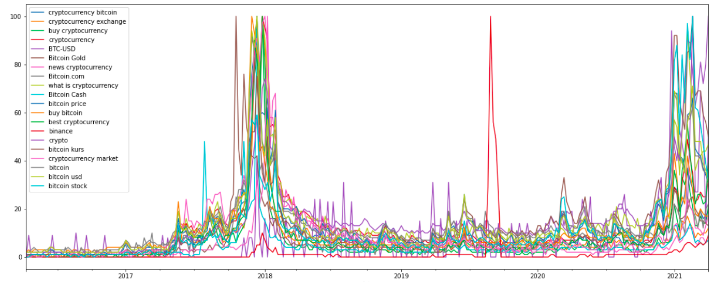
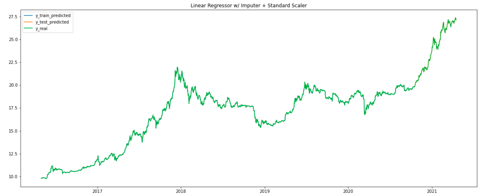

# Eduard Bateiko Portfolio

# Project 1: Bitcoin prediction for 1 day

Predict stock value of Bitcoin price. I used Yahoo API for gathering stock value and Google Trends API. 

After gathering normalized values of searcing words with 85% of missing values. Used linear interpolation for filling missing values. Next step is to concatenated the Bitckoin time series price and other time series (amount of searching words "bircoin", "BTC", "bitcoin exhange", "cryptocurrency" etc.)

Saved trained models, lags count, features importances, image with prediction on train and test in MLFlow. Too saved statisctics for residual like mean, std, autocorrelation, partial autocorrelation, QQ-plot and PDF for train and test set.

**Feature engeneering**: got from each time series lags, moving average, exponential moving average, moving standart deviation, exponential standart deviation. Prepared data like regression task.  
**Research**: Compared result using Box-Cox transformation and not. 
Worked with not stationar time series.  
**Libraries**: scikit-learn, Pandas, Numpy, Featuretools, SciPy, Matplotlib, Pandas-Profiling, yahoofinance, pytrends, statsmodels, MLFlow. 
**Models** : RandomForest, XGBoost, LinearRegression, Extra Trees, Decision Tree, Elastic Net.

